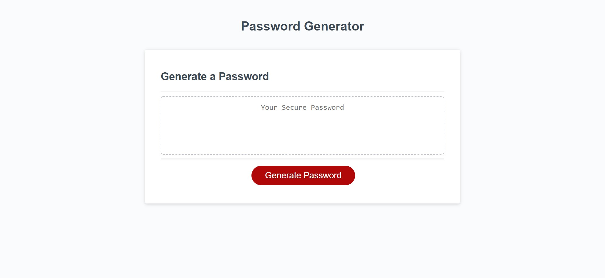

# Password-creator

## Purpose

A password generator allowing the user to choose what variables are in the password, ie. uppercase and lowercase letters, numbers, and characters. Along with how many characters the password may contain.

## Challenges

A few main challenges I ran into were building an empty string and array to input variables as the user moves though the prompt's. Also making the password reset after each time the user clicked "generate password" made me think critically. With help from TA's, my tutor, and reources like W3 and MDN. I was able to get my Password creator like you see it now.

## Built With

* HTML
* CSS
* Javascript

## Website

<https://dsapione.github.io/Password-creator/>
